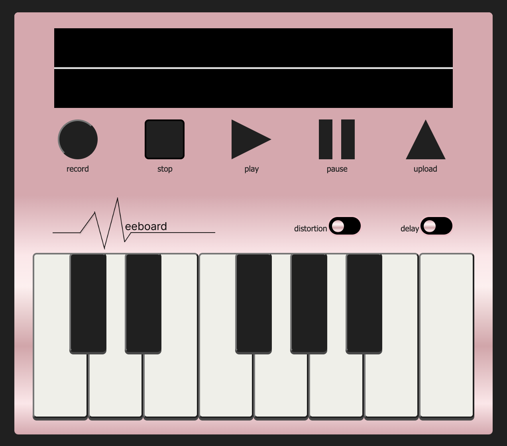

### Hello, I'm Justin. Welcome to my github page!

I recently finished an App called the Meeboard. It's an audio sampler that records any sound you want and plays back your recording at different pitches on the keyboard keys. If you register you can save your files and use them again in the future.

<a href = "https://fast-oasis-59176-b290032bbf92.herokuapp.com/#/user">Try it out!</a>
